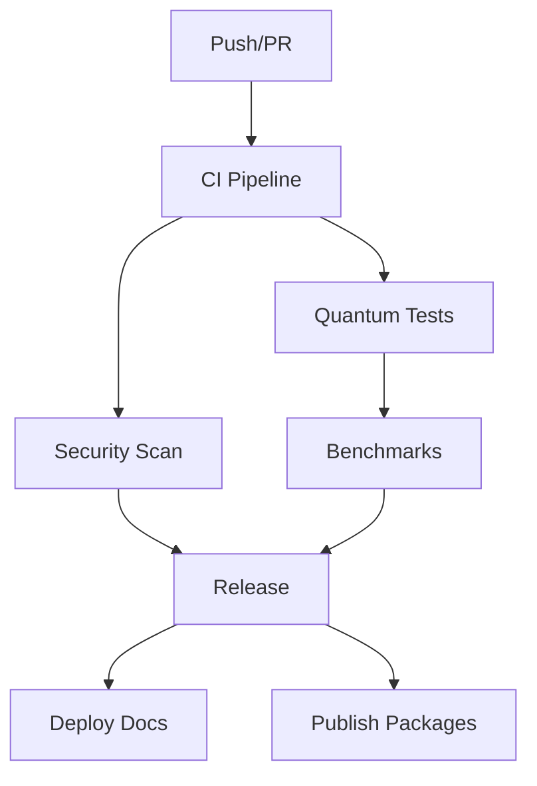

# GitHub Actions Workflows for Quantum DevOps CI

This directory contains documentation and templates for GitHub Actions workflows that should be implemented in `.github/workflows/`.

⚠️ **Important**: Due to GitHub App permission limitations, the workflow files in `examples/` need to be manually copied to `.github/workflows/` by a repository administrator.

## 🚀 Quick Setup

```bash
# Copy workflow files to the correct location
mkdir -p .github/workflows
cp docs/workflows/examples/*.yml .github/workflows/

# Commit and push the workflows
git add .github/workflows/
git commit -m \"feat: add GitHub Actions workflows\"
git push origin main
```

## 🔧 Required Workflows

### Core CI/CD Workflows

1. **[ci.yml](ci.yml)** - Main CI/CD pipeline
   - Runs on: Push to main/develop, Pull Requests
   - Features: Multi-language testing, quantum linting, security scans

2. **[quantum-tests.yml](quantum-tests.yml)** - Quantum-specific testing
   - Runs noise-aware tests with multiple backends
   - Hardware compatibility validation
   - Performance benchmarking

3. **[release.yml](release.yml)** - Automated releases
   - Semantic versioning
   - NPM and PyPI publishing
   - Docker image builds

4. **[security.yml](security.yml)** - Security scanning
   - Dependency vulnerabilities
   - Secret detection
   - SAST/DAST analysis

### Specialized Workflows

5. **[docs.yml](docs.yml)** - Documentation deployment
6. **[benchmarks.yml](benchmarks.yml)** - Performance monitoring
7. **[dependency-update.yml](dependency-update.yml)** - Automated updates

## 🚀 Quick Setup

```bash
# Create GitHub Actions directory
mkdir -p .github/workflows

# Copy workflow templates
cp docs/workflows/*.yml .github/workflows/

# Set up required secrets in GitHub repository settings:
# - QISKIT_IBM_TOKEN
# - NPM_TOKEN
# - PYPI_TOKEN
# - DOCKER_HUB_TOKEN
```

## 🔐 Required Secrets

Configure these secrets in your GitHub repository:

### Quantum Hardware Access
- `QISKIT_IBM_TOKEN` - IBM Quantum Network token
- `AWS_BRAKET_CREDENTIALS` - AWS Braket credentials (JSON)
- `GOOGLE_QUANTUM_AI_KEY` - Google Quantum AI API key

### Publishing
- `NPM_TOKEN` - NPM registry token
- `PYPI_TOKEN` - PyPI API token
- `DOCKER_HUB_TOKEN` - Docker Hub token

### Security & Monitoring
- `CODECOV_TOKEN` - Code coverage reporting
- `SNYK_TOKEN` - Security vulnerability scanning

## 📋 Workflow Features

### ✅ Multi-Language Testing
- Python 3.8, 3.9, 3.10, 3.11, 3.12
- Node.js 16, 18, 20
- Matrix testing across OS (Ubuntu, macOS, Windows)

### ✅ Quantum-Specific Features
- Noise-aware testing with realistic quantum noise models
- Circuit optimization validation
- Hardware compatibility checks
- Performance regression detection

### ✅ Security Integration
- Dependency vulnerability scanning (Safety, Snyk)
- Secret detection (detect-secrets)
- SAST analysis (Bandit, ESLint security rules)
- Container security scanning

### ✅ Quality Assurance
- Code formatting (Black, Prettier)
- Linting (Flake8, ESLint, MyPy)
- Test coverage reporting
- Documentation generation

### ✅ Performance Monitoring
- Quantum circuit benchmarking
- Execution time tracking
- Memory usage profiling
- Hardware utilization metrics

## 🔄 Workflow Dependencies



## 📊 Success Metrics

Each workflow tracks:
- **Build Success Rate**: >95% passing builds
- **Test Coverage**: >90% code coverage
- **Security Score**: Zero high/critical vulnerabilities
- **Performance**: <10% regression tolerance
- **Documentation**: Up-to-date with code changes

## 🏗️ Customization

### Environment Variables
```yaml
env:
  QUANTUM_FRAMEWORK: "qiskit"  # or "cirq", "pennylane"
  TEST_BACKEND: "qasm_simulator"
  NOISE_LEVEL: "0.01"
  MAX_CIRCUIT_DEPTH: "100"
```

### Matrix Strategies
```yaml
strategy:
  matrix:
    python-version: [3.8, 3.9, 3.10, 3.11, 3.12]
    quantum-framework: [qiskit, cirq, pennylane]
    os: [ubuntu-latest, macos-latest, windows-latest]
```

## 🔧 Troubleshooting

### Common Issues

1. **Quantum Hardware Access Denied**
   - Verify tokens are correctly set in repository secrets
   - Check token permissions and quotas

2. **Test Failures in CI**
   - Review noise models and simulation parameters
   - Adjust timeout values for quantum simulations

3. **Build Matrix Failures**
   - Check framework compatibility across Python versions
   - Verify OS-specific dependencies

### Debug Commands
```bash
# Local workflow testing
act -j ci

# Validate workflow syntax
actionlint .github/workflows/*.yml

# Test quantum components locally
quantum-test run --ci --verbose
```

## 📚 Additional Resources

- [GitHub Actions Documentation](https://docs.github.com/en/actions)
- [Quantum CI/CD Best Practices](../quantum-cicd-guide.md)
- [Security Configuration Guide](../security/README.md)
- [Performance Benchmarking Guide](../benchmarking/README.md)